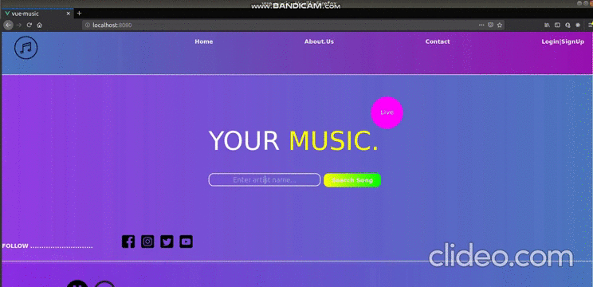

# VueProjects
## Demo:

### todo-app :


### vue-music :

## You can view the site here
http://aman-music-app.surge.sh/



### website-template :


### I'll be rewriting all the apps writen in Vue2, using Vue3 just for fun and to practice all the cool stuffs that Vue3 provides.

## I've used npm with vue2 so for serving the apps with hot reload.

```
npm run serve
```

## For Vue3 I've used yarn so for serving the apps with hot reload.

```
yarn serve
```